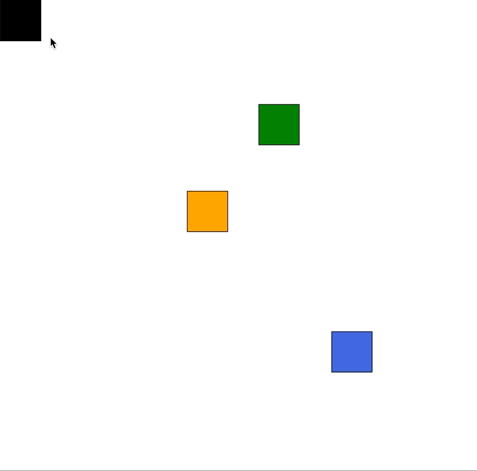

# ✊ Simple-Draggable-Component with React

## Skills

`React` `Typescript`

## Getting Start

1. `git clone [this repository]`

2. `yarn install`

3. `yarn start`

4. you can see project in `localhost:3000`
